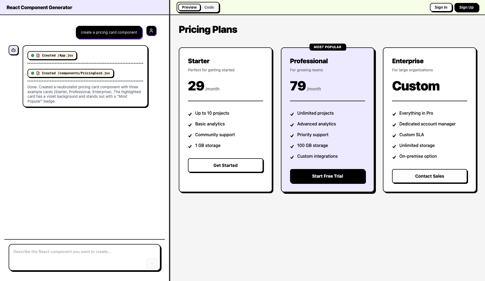

# Neubrutalism Skill

Install a reusable neubrutalist design skill for coding agents.



## Install

```bash
npx skills add lmist/neubrutalism-skill
```

## What it includes

- A `neubrutalism` skill with Tailwind CSS guidance for React and Next.js UIs.
- Concrete patterns for buttons, inputs, cards, tabs, dialogs, and layout structure.
- Clear rules for shadows, borders, typography, colors, and interaction states.

## Example Output

The screenshot above shows a pricing card generated in `UIGen` using this skill's design rules.

## Skill path

- Root `SKILL.md` for compatibility with `skills.sh` discovery.
